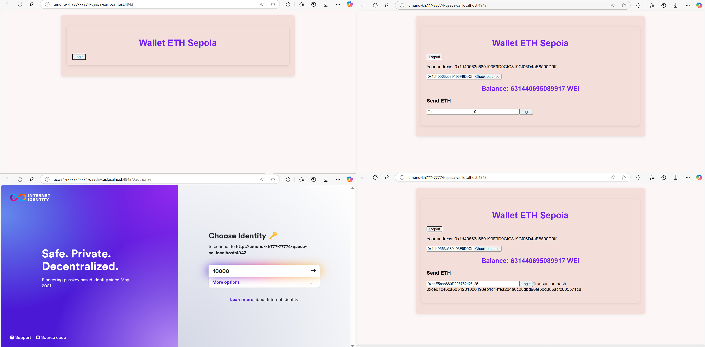

# ETH Wallet
Allows to manage your ETH Wallet on ICP with a UI. Check your (or other wallet's) balance and make transfers. Based on [basic_etherium](https://github.com/dfinity/examples/tree/master/rust/basic_ethereum) example with an addition of the UI.

## Deploy locally
`dfx start` and `dfx deploy`
